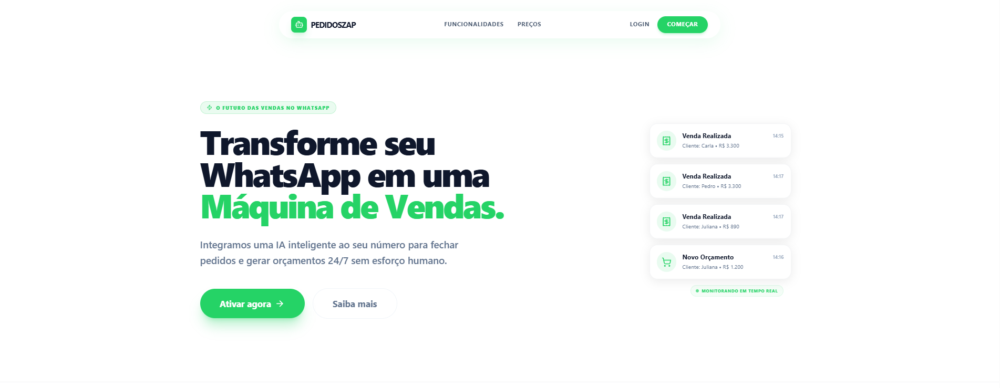
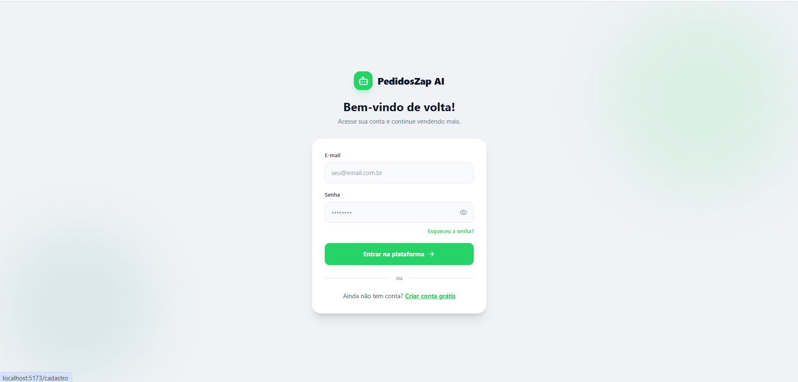
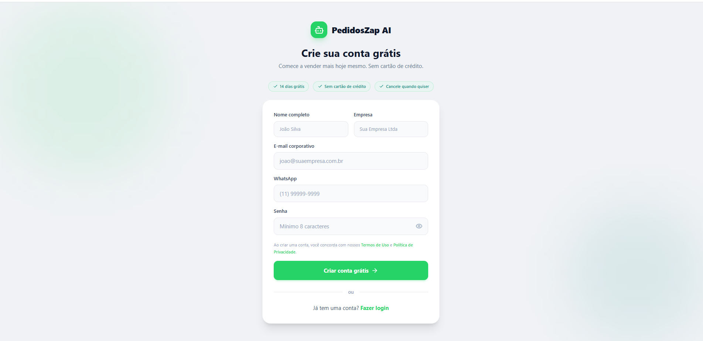
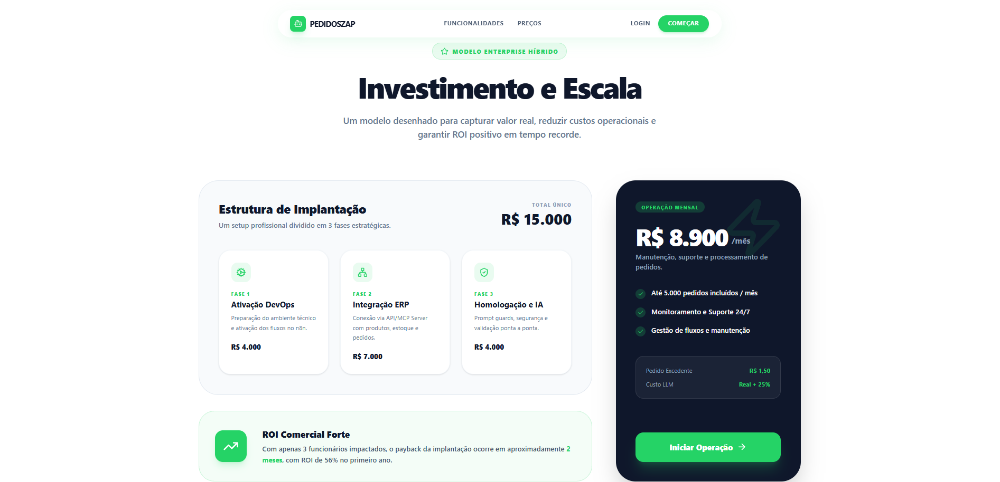
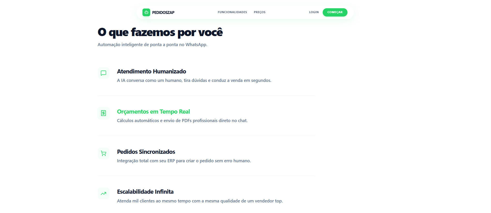
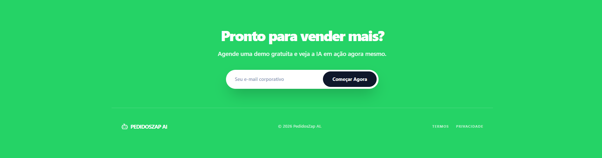

# PedidosZap Landing Page 🚀

> Landing page moderna para uma plataforma SaaS de automação de pedidos via WhatsApp com Inteligência Artificial.

---

## Objetivo do Projeto

Este projeto foi desenvolvido como parte de um **Hackathon realizado na Faculdade de Nova Serrana (FANS)**.

O objetivo foi criar uma solução moderna para:

- Automatização de pedidos via WhatsApp  
- Otimização de processos comerciais  
- Melhoria na experiência do cliente  
- Aplicação de conceitos de UI/UX em produtos SaaS  

---

## Demo

🔗 https://pedidoszap-landing-page.vercel.app/

---

##  Preview da Aplicação

### 🏠 Página Inicial (`/`)


### 🔐 Login (`/login`)


### 📝 Cadastro (`/cadastro`)


### ⚙️ Operação


### 📄 Sobre


### 📌 Footer


---


---

## Funcionalidades

- Landing page moderna e responsiva  
- Seções comerciais (Hero, benefícios, CTA)  
- Simulação de fluxo SaaS  
- Tela de login  
- Tela de cadastro  
- Interface focada em conversão  
- Layout profissional  

---

## Estrutura do Projeto
```bash
pedidoszap-landing-page/
│
├── public/
├── screenshots/
├── src/
│ ├── assets/
│ ├── pages/
│ ├── App.jsx
│ ├── main.jsx
│ ├── App.css
│ └── index.css
│
├── index.html
├── package.json
├── tailwind.config.js
├── vite.config.js
└── README.md
```

---

## Como Executar:

### 1. Clonar repositório

```bash
git clone https://github.com/MatheusPereiira/pedidoszap-landing-page.git
```
### 2. Entrar na pasta
```bash
cd pedidoszap-landing-page
```
### 3. Instalar dependências
```bash
npm install
```
### 4. Rodar o projeto
```bash
npm run dev
```
---
## Rotas da Aplicação
```json
/	--> Home
/login	--> Tela de login
/cadastro --> Tela de cadastro
```
---
## Autenticação
POST /api/auth/login

#### Body:
```json
{
  "email": "usuario@email.com",
  "password": "123456"
}
```

POST /api/auth/register

#### Body:
```json
{
  "name": "Nome",
  "company": "Empresa",
  "email": "email@email.com",
  "phone": "31999999999",
  "password": "123456"
}
```

---

## Responsividade

- Desktop ✔️
- Tablet ✔️
- Mobile ✔️

---

## Design

- Interface moderna estilo SaaS
- Utilização de Tailwind CSS
- Componentização com React
- Foco em experiência do usuário

---

## Autor

Desenvolvido por **Matheus Pereira**
Projeto desenvolvido em equipe durante um Hackathon da Faculdade de Nova Serrana (FANS), utilizando metodologia **Kanban**, com divisão de tarefas por etapas do desenvolvimento (planejamento, interface, funcionalidades e validações).

---